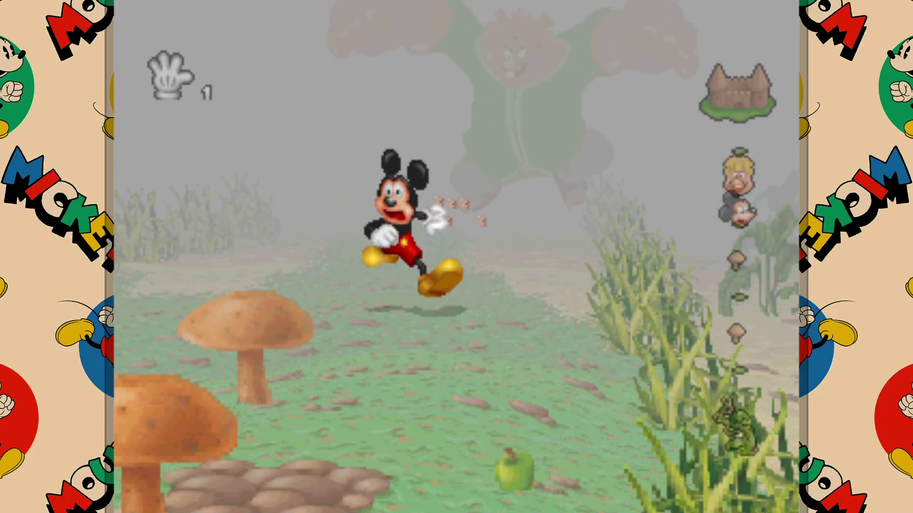

# Mickey's Wild Adventure Recompiled

Native recompilation of **Mickey's Wild Adventure** (PlayStation) for modern PCs, powered by [PSXRecomp](https://github.com/RetroPortingToolKit/psxrecomp).

This project aims to preserve the original game while making it easier and more enjoyable to play on modern hardware with quality-of-life improvements, a custom frontend, modern display options and extra features.

> This is **not an emulator** and **not a remake**.  
> The original PlayStation game code is statically recompiled into native code using PSXRecomp.

---

## Screenshot



---
## 🎬 Official Trailer

[](https://youtu.be/ZzpwqbgKv98)
---

## Features

- Native **Windows** and **Linux** builds
- Powered by **PSXRecomp**
- Custom frontend and startup flow
- Custom main menu
- Story profiles and continue system
- Improved save handling
- Practice Mode protected from overwriting Story progress
- Custom pause menu
- Restart Level option
- Custom Game Over screen
- Resolution options
- Windowed, borderless and fullscreen display modes
- CRT filter presets
- Optional bezels
- Keyboard and controller support
- Rebindable controls
- Automatic input prompt switching
- Multiple UI languages
- Custom loading screens
- Gameplay tips during loading
- Saving overlay
- RetroAchievements integration
- OpenBIOS integration
- Dedicated build workflow for supported game dumps

---

## Supported Game Version

This project currently targets:

- **Mickey's Wild Adventure (Europe)**
- **SCES-00163**

A proper **CUE/BIN dump with all 28 tracks** is required.

---

## Quick Start

### For players

1. Obtain your own legal copy of **Mickey's Wild Adventure (Europe)**.
2. Dump the disc as a proper **CUE/BIN** image with all audio tracks intact.
3. Launch **Recomp Build Studio**.
4. Select the **folder containing one `.cue` file and all 28 referenced `.bin` tracks**. The Browse button selects a folder, not a CUE file.
5. Choose your target platform:
   - Windows x64
   - Linux x86_64
6. Build the project.
7. Open the resulting package and run `RUN_GAME.bat` (Windows) or `RUN_GAME.sh` (Linux).

---

## Recomp Build Studio

This repository includes **Recomp Build Studio**, a guided build tool intended to make the process easier.

It handles the main setup steps such as:

- verifying the disc image
- checking for the correct game version
- validating the track layout
- preparing the runtime
- building a runnable native version of the game

This is the recommended way to build the project.

---

## Automatic OpenBIOS preparation

Build Studio extracts the existing MIT-licensed ROM from `project/embedded_openbios.cpp`,
checks its 524288-byte size and pinned SHA-256, and writes the profile's expected input:
`project/psxrecomp/bios/openbios.bin`. No Sony BIOS is required.

On the first build it configures and compiles the bundled **C++20** `psxrecomp-bios` generator
using CMake and Ninja. Rabbitizer headers are generated automatically from the bundled
upstream templates; no Bash developer scripts or additional downloads are needed for this
stage. The original `bios/OpenBIOS.toml` profile and bundled seed list then produce
`project/psxrecomp/generated/OpenBIOS_full.c` and `OpenBIOS_dispatch.c`.

Build Studio verifies the ROM provenance, runtime backend descriptor and C syntax before
runtime configuration. It caches hashes of the generated files and their inputs, including
the profile, seeds, emitter/runtime headers and codegen environment settings. Matching
outputs are reused; missing, changed or corrupt files are regenerated. Failed generation
never permits runtime compilation with incomplete outputs. Progress and errors appear in
the normal build log; users only need to click **Build**.

The packaged `bios/openbios.bin` and `bios/OpenBIOS.LICENSE` accompany the executable and
frontend assets. Generated BIOS files and local generator build artifacts stay untracked.
Linux-to-Windows builds use a native Linux BIOS generator before cross-compiling the runtime;
`BIOS_CC`, `BIOS_CXX`, `BIOS_AR`, `BIOS_LD` and `BIOS_RANLIB` can override its host tools.
Windows-to-Linux builds run this stage inside WSL.

## Windows installation (first build)

Use 64-bit Windows and your own legally obtained **European SCES-00163** disc dump.
Installing MSYS2 alone does not install all the tools needed to compile the game.

1. Install **Python 3.10 or newer** from [python.org](https://www.python.org/downloads/windows/).
   Include **Tcl/Tk**, the Python launcher, and **Add python.exe to PATH**.
2. Install [MSYS2](https://www.msys2.org/) (normally `C:\msys64`). Open **MSYS2 MINGW64** from
   the Start menu. Update it with `pacman -Syu`; if asked to close the terminal, reopen MINGW64
   and run the update again.
3. In that **MINGW64 terminal**, install the native Windows tools:

   ```sh
   pacman -S --needed mingw-w64-x86_64-toolchain mingw-w64-x86_64-cmake mingw-w64-x86_64-ninja
   ```

   Accept the toolchain group defaults. This supplies GCC, G++, binutils, CMake and Ninja.
   Follow [MSYS2's CMake guide](https://www.msys2.org/docs/cmake/) and use the **MinGW** packages.
   The plain MSYS `/usr/bin/gcc` toolchain targets MSYS and cannot make this Windows x64 game.
   An existing complete **UCRT64** GCC installation is also detected; keep the compiler and
   its libraries/tools from the same environment ([MSYS2 environments](https://www.msys2.org/docs/environments/)).
4. Close any old Build Studio windows, then double-click `START_BUILDER_WINDOWS.bat` in this
   repository. It checks Python and Tcl/Tk before opening the GUI. Build Studio checks every
   required tool at startup and whenever the target changes. Read the **Dependencies and
   build log**: `FOUND` includes the actual path; `MISSING / UNUSABLE` includes installation steps.
   After fixing a dependency, click **Retry Check**. Build stays disabled until the checks pass.
   If you changed Windows environment variables, restart Build Studio first.
5. Choose **Windows x64**. Browse to the folder containing **exactly one CUE and all 28 BIN
   tracks**, keeping the filenames referenced inside the CUE unchanged. A single ISO is not
   sufficient because the original audio tracks are needed. The builder checks for the
   supported `SCES_001.63` serial in the first track.
6. Choose an output location, then click **Build**. The first configuration may download
   pinned SDL3/zlib sources if they are not available locally, so allow Internet access.
   No system packages are installed automatically.
7. Run `<output>\Windows\MickeyWildAdventureRecompiled\RUN_GAME.bat`. The package contains
   your local disc copy and frontend assets. Choose a new output folder for another package.

### Verify the tools

In **MSYS2 MINGW64**:

```sh
cmake --version
ninja --version
gcc -dumpmachine
g++ -dumpmachine
```

CMake must be **3.20 or newer**. Both compilers should report `x86_64-w64-mingw32`.
In Windows Command Prompt, from this repository:

```bat
py -3 --version
py -3 -m tkinter
py -3 builder_core.py --target windows --check-dependencies
```

The Tkinter command opens a small test window. The dependency check needs no game files;
it exits with an error and actionable messages if anything is missing.

### Custom installations and PATH

Build Studio searches PATH and common installations, including `C:\Program Files\CMake\bin`
and `C:\msys64\mingw64\bin`. It adds discovered tool folders to the build process's PATH;
you do not need to add these default locations to the global Windows PATH yourself.
For other locations, use **Environment Variables** in Windows or launch from a Command Prompt
with settings such as these (replace the examples with your actual folders):

```bat
set "MSYS2_ROOT=D:\Development Tools\msys64"
set "CMAKE=C:\Program Files\CMake\bin\cmake.exe"
set "NINJA=D:\Development Tools\msys64\mingw64\bin\ninja.exe"
START_BUILDER_WINDOWS.bat
```

`MSYS2_ROOT` is the installation root, **not** its `mingw64\bin` folder. The builder also
recognizes existing `MINGW_PREFIX`, `MSYSTEM_PREFIX`, `CC` and `CXX` settings and can infer a
custom MSYS2 root from the compiler on PATH. `CC` and `CXX` must name executables from the
same 64-bit MinGW installation. `RC`, `AR`, `LD` and `RANLIB` can also select helper executables. Optional `CMAKE_ROOT`/`NINJA_ROOT` can name tool folders.
Explicit executable settings must contain one executable path, without compiler flags.
Paths containing spaces are supported; use the `set "NAME=value"` syntax shown above.
An invalid explicit setting is reported rather than silently ignored.

If CMake is installed separately, its Windows installer can add it to PATH, or use the
`CMAKE` setting above. Ninja must also be installed; CMake cannot compile with the Ninja
generator until Ninja is present. Installing MSYS2 without its MinGW tool packages is
insufficient. If a file exists but cannot run, check the reported path and reinstall its
package to restore any missing runtime DLLs.

## Linux and cross builds

For native Linux x86_64 builds, install Python 3.10+ with Tk, CMake 3.20+, Ninja, GCC/G++,
pkg-config, and libcurl/OpenGL development packages. On Ubuntu/Debian:

```sh
sudo apt install python3 python3-tk cmake ninja-build gcc g++ pkg-config libcurl4-openssl-dev libgl1-mesa-dev
python3 builder_core.py --target linux --check-dependencies
sh START_BUILDER_LINUX.sh
```

Use your distribution's equivalent packages on other systems. SDL3 and zlib are resolved
by the existing PSXRecomp CMake configuration. Native builds use the same disc-folder selection
and copy all tracks into the final local package.

To cross-build Windows on Linux, also install `gcc-mingw-w64-x86-64`,
`g++-mingw-w64-x86-64` and `binutils-mingw-w64-x86-64`, then select Windows x64.
To build Linux from Windows, install WSL with a default Linux distribution and install the
Linux dependencies **inside that distribution**. Selecting Linux checks tools in WSL and
uses its CMake and compilers. Windows compiler settings do not configure the WSL toolchain.
Library metadata checks are advisory because CMake also searches custom installations configured
with settings such as `CMAKE_PREFIX_PATH`, `CURL_ROOT` and `SDL3_DIR`. CMake validates the libraries
before compilation.

Automated checks (no disc required):

```sh
python3 -m unittest discover -s tests -v
python3 -m compileall -q builder.py builder_core.py build_dependencies.py tests
```

---

## Manual Build

Advanced users can also build the project manually.

### Requirements

- **CMake 3.20+**
- **Ninja**
- A C/C++ toolchain supporting C++20 for BIOS generation
- **SDL3**
- **OpenGL**
- Python 3.10+ with Tk (Build Studio)

Depending on your platform, additional dependencies may be required.

### Basic build flow

```bash
cmake -S project -B work/build -G Ninja -DCMAKE_BUILD_TYPE=Release
cmake --build work/build
```

> Exact setup may differ depending on platform and local environment.

---

## Controls and Input

The project supports:

- keyboard
- gamepads/controllers
- automatic prompt switching
- rebinding controls

Input prompts change dynamically depending on the active device.

---

## Save System

The recomp includes a custom save/profile layer on top of the original game flow.

### Story Mode

- uses profile-based progress
- supports continue/checkpoint behavior
- is protected from accidental overwrite issues

### Practice Mode

- designed as a **no-save mode**
- does **not** overwrite Story progress

---

## Display Features

The project includes several modern display options:

- multiple resolutions
- windowed mode
- borderless fullscreen
- exclusive fullscreen
- CRT filter presets
- bezel artwork options

These are intended to keep the original game's look and feel while improving presentation on modern displays.

---

## RetroAchievements

The project includes **RetroAchievements** support.

Features include:

- login support
- achievement list
- badge display
- unlock notifications

RetroAchievements are optional, but supported directly through the project frontend.

---

## Languages

The interface supports multiple languages, including:

- English
- Polish
- Italian
- Japanese
- German

---

## Project Structure

A simplified overview:

```text
builder.py               Build Studio GUI
builder_core.py          Disc validation, compilation and packaging
build_dependencies.py    Shared dependency checks
project/                 Main project files
project/psxrecomp/        Bundled PSXRecomp runtime and frontend code
project/assets/          UI/audio/art assets
work/                    Build output and temporary build data
```

> Exact structure may change as the project evolves.

---

## About PSXRecomp

This project is built on top of **PSXRecomp**, a static recompilation framework for original PlayStation games.

PSXRecomp repository:  
https://github.com/RetroPortingToolKit/psxrecomp

Without PSXRecomp, this project would not be possible.

---

## Legal

**No copyrighted game files are included with this repository.**

You must provide your own legally obtained copy of the supported PlayStation game.

This is an unofficial, non-commercial fan project. It is not affiliated with, endorsed by, or sponsored by Disney, Sony, Traveller's Tales, or any other rights holder.

All trademarks, characters, game assets and original game content belong to their respective owners.

---

## Credits

- **Original game:** Traveller's Tales
- **Based on:** Disney's Mickey Mouse
- **Static recompilation framework:** PSXRecomp
- **Project / additional PC features:** Kacperek

---

## Disclaimer

This project is a fan-made tribute created for preservation, experimentation and accessibility on modern systems.

Please support the original creators and rights holders whenever possible.

## Windows cross-builds on Fedora / Nobara

Install the native Linux tools **and** the Windows target development packages:

```sh
sudo dnf install python3 python3-tkinter cmake ninja-build gcc gcc-c++ binutils \
  pkgconf-pkg-config libcurl-devel mesa-libGL-devel \
  mingw64-gcc mingw64-gcc-c++ mingw64-binutils mingw64-headers mingw64-crt \
  mingw64-winpthreads-static mingw64-zlib-static
```

The MinGW compiler targets Windows; `gcc` and `g++` still build the Linux BIOS
code generator. Build Studio checks both toolchains and compiles/links a small
Windows dependency probe before the game build. It never runs that probe.
The toolchain discovers GCC's target sysroot, including Fedora's
`x86_64-w64-mingw32/sys-root/mingw` layout. CMake searches only Windows libraries
and isolates pkg-config from Linux packages.

Verify and build from the repository:

```sh
x86_64-w64-mingw32-g++ -dumpmachine
python3 builder_core.py --target windows --check-dependencies
sh START_BUILDER_LINUX.sh
```

Select **Windows x64**, choose the folder containing your legally obtained
European **SCES-00163 CUE and all 28 BIN tracks**, select the output folder, and
click **Build**. The final folder is `Windows/MickeyWildAdventureRecompiled`.
Copy the entire folder to a Windows machine and double-click `RUN_GAME.bat`.
Do not redistribute the original disc files without the necessary rights.

For a custom or relocated MinGW installation, add its `bin` folder to `PATH`
or set `CC`, `CXX`, `AR`, `LD`, `RANLIB` and `RC` to its full tool paths. Set
`MINGW_SYSROOT` only when GCC's own target root needs overriding. Paths may contain
spaces. For a user-local installation without sudo, DNF5 can download RPMs with
`dnf download --resolve --destdir=<folder> <packages>`; extract them into a private
prefix and add `<prefix>/usr/bin` to PATH. Build Studio never installs packages.

Every Windows package is checked as an AMD64 PE32+ executable. Normal and delay
imports are inspected, required non-system DLLs are copied from the build/toolchain
folders, and their own imports are checked recursively. `windows-imports.json`
records hashes and imports. Missing DLLs stop packaging with the DLL name and
searched folders. `WINDOWS_DLL_PATH` can list additional **Windows x64** DLL folders
(separated by `:` on Linux, `;` on Windows). A statically linked build normally
needs only Windows system DLLs. Wine is never included in the package.

### Optional Wine validation

Wine is not a build dependency. On Fedora/Nobara it can be installed separately:

```sh
sudo dnf install wine
python3 builder_core.py --target windows \
  --disc-folder "/path/to/Mickey's Wild Adventure (Europe)" \
  --output "/path/to/new/output" --wine-smoke
```

After a Windows build, the Linux GUI's **Wine startup check** button performs the
same bounded headless check. It uses a new private prefix under `work/wine-check`,
leaves the default Wine prefix alone, and saves `work/wine-check/wine-startup.log`.
It checks PE loading, the PAL disc identity and OpenBIOS execution markers.
A Wine check failure leaves the completed Windows package available.

For a graphical check, use a separate prefix and run the packaged launcher:

```sh
cd "/path/to/output/Windows/MickeyWildAdventureRecompiled"
WINEPREFIX="/absolute/path/to/private-wine-prefix" wine cmd /c RUN_GAME.bat
```

Verify the rendered title screen, main menu, keyboard/controller navigation,
audio and gameplay. A headless check does **not** verify these. Hardware OpenGL
should be confirmed in the application log's `OpenGL context created` line;
process launch alone is insufficient. Wine testing also does **not** replace
native Windows testing. Keep test saves/profiles separate from a clean delivery.
