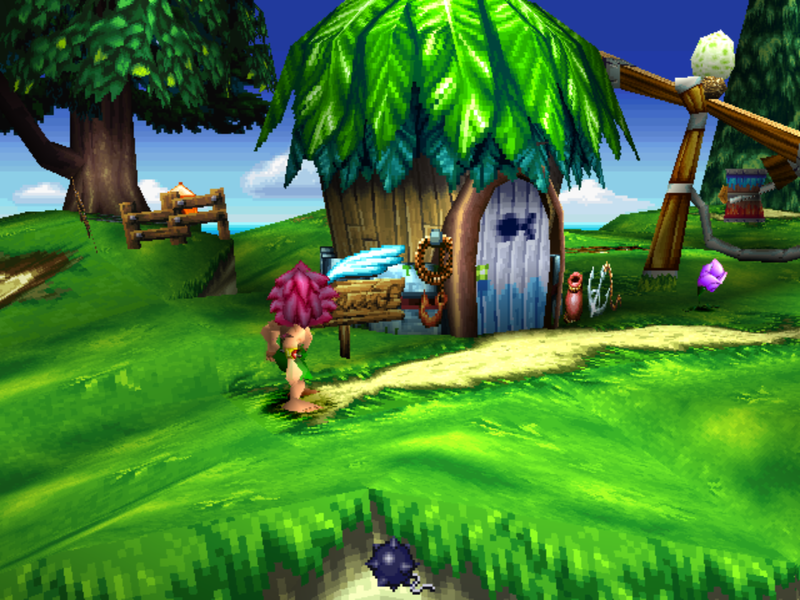
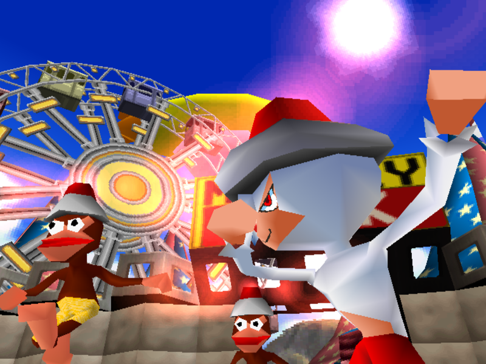
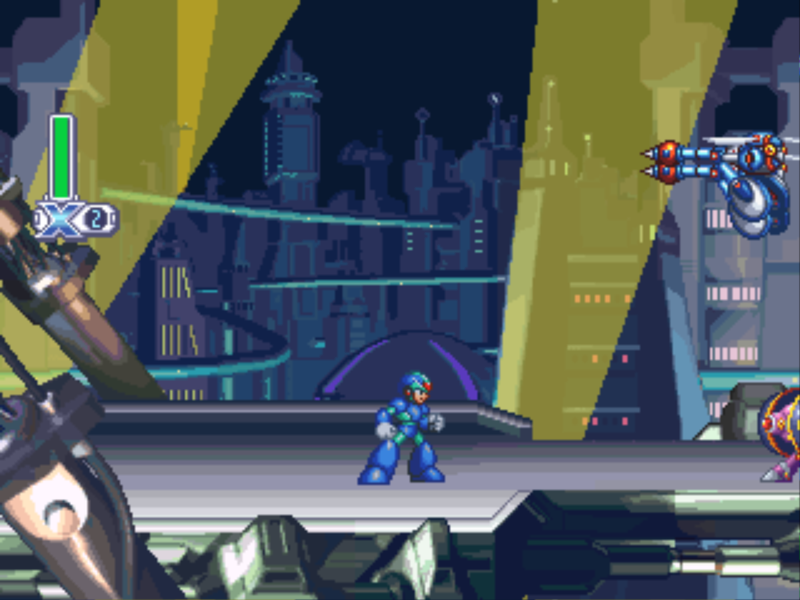
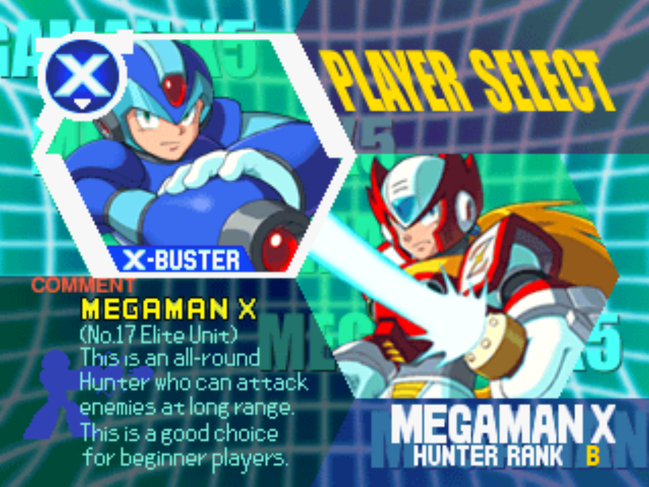
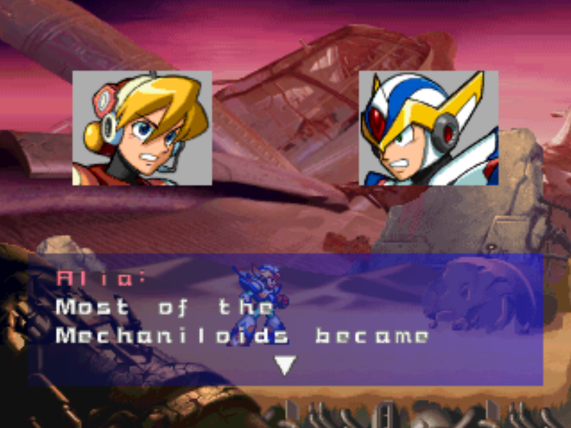
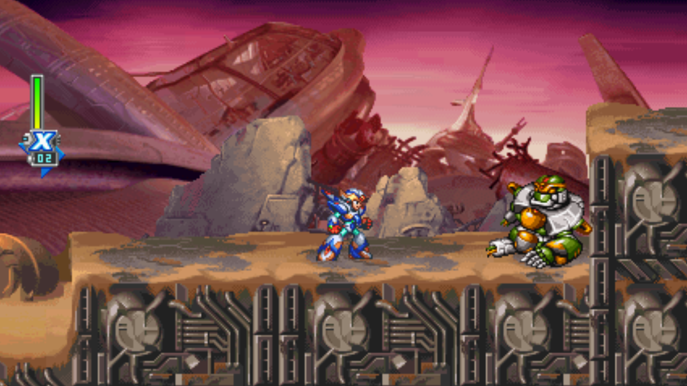
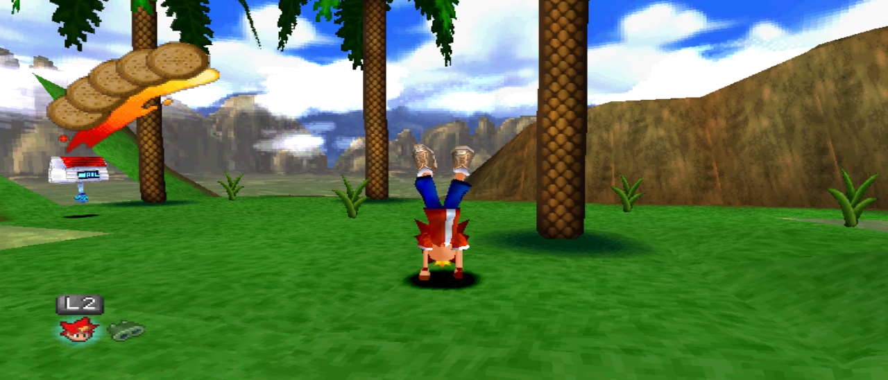
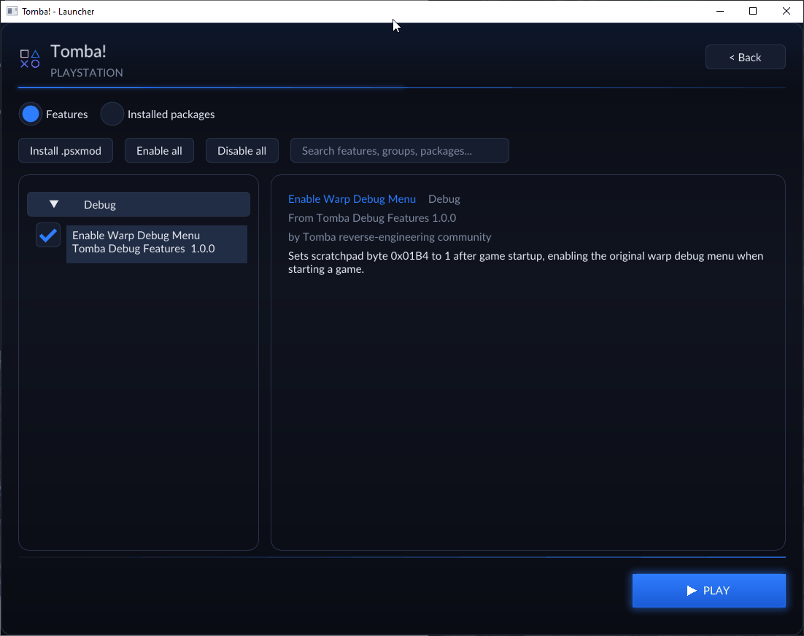

<p align="center">
  
</p>

# PSXRecomp

**A general-purpose static recompiler for the PlayStation 1.** It turns a PS1
disc into a native executable — MIPS R3000A translated to C, compiled to x64,
linked against a hardware-accurate runtime. Not an emulator: the game becomes a
program your CPU runs directly.

Titles brought up on it ship as standalone builds with widescreen, mods, live
language switching and a launcher. They can run on either the bundled,
open-source **OpenBIOS** or a compatible **retail BIOS** supplied by the player;
OpenBIOS is the default, so a retail BIOS dump is not normally required. The
framework is general-purpose: bringing up a new game is a matter of
configuration and reverse engineering, not new engine work.

<table>
  <tr>
    <td width="33%"><br><sub><b>Tomba!</b></sub></td>
    <td width="33%"><br><sub><b>Tomba! 2</b></sub></td>
    <td width="33%"><br><sub><b>Ape Escape</b></sub></td>
  </tr>
  <tr>
    <td><br><sub><b>Mega Man X4</b></sub></td>
    <td><br><sub><b>Mega Man X5</b></sub></td>
    <td><br><sub><b>Mega Man X6</b></sub></td>
  </tr>
</table>

Background on the original prototype:
[I Built a PS1 Static Recompiler With No Prior Experience (and Claude Code)](https://1379.tech/i-built-a-ps1-static-recompiler-with-no-prior-experience-and-claude-code/)

## Games

Each game is its own repository that pins a framework commit as a submodule and
ships its own playable release with an in-app launcher. Validation and feature
coverage continue to improve per title.

| Game | Repository | Latest build | Notes |
|---|---|---|---|
| *Tomba!* | [TombaRecomp](https://github.com/mstan/TombaRecomp) | [releases](https://github.com/mstan/TombaRecomp/releases/latest) | Widescreen, supersampling, save/load, mod packages. |
| *Tomba! 2* | [Tomba2Recomp](https://github.com/mstan/Tomba2Recomp) | [releases](https://github.com/mstan/Tomba2Recomp/releases/latest) | Multi-track disc support; adaptive widescreen through 21:9. |
| *Ape Escape* | [ApeEscapeRecomp](https://github.com/mstan/ApeEscapeRecomp) | [releases](https://github.com/mstan/ApeEscapeRecomp/releases/latest) | Widescreen to 21:9, memory-card save/load, dual-analog. |
| *Mega Man X4* | [MegaManX4Recomp](https://github.com/mstan/MegaManX4Recomp) | [releases](https://github.com/mstan/MegaManX4Recomp/releases/latest) | Playable; 2D widescreen. |
| *Mega Man X5* | [MegaManX5Recomp](https://github.com/mstan/MegaManX5Recomp) | [releases](https://github.com/mstan/MegaManX5Recomp/releases/latest) | Playable; 2D widescreen. |
| *Mega Man X6* | [MegaManX6Recomp](https://github.com/mstan/MegaManX6Recomp) | [releases](https://github.com/mstan/MegaManX6Recomp/releases/latest) | Playable; stages, controller, save/load; 2D widescreen to 21:9. |
| *Tsumu Light* | [TsumuLightRecomp](https://github.com/mstan/TsumuLightRecomp) | [releases](https://github.com/mstan/TsumuLightRecomp/releases/latest) | Japanese-only title (SLPS-02253); first consumer of [live language switching](#swap-language-on-the-fly). |
| *Xenogears* — **community** | [OpokXeno/xenogears-recomp](https://github.com/OpokXeno/xenogears-recomp) | — | Independent project by [@OpokXeno](https://github.com/OpokXeno), who also contributed widescreen cull-site work upstream. |

Each game repo carries its own build/run instructions, keyboard/controller
mappings, and per-game settings. **This repository builds the framework and a
standalone BIOS runtime supporting OpenBIOS and a compatible retail BIOS** —
see [Release Package](#release-package) below.

Bringing up a title of your own? Start with
[`docs/GAME_PROJECT_SETUP.md`](docs/GAME_PROJECT_SETUP.md) (submodules,
setup-host CI template, release checklist), then
[`CONTRIBUTING.md`](CONTRIBUTING.md). Community projects are listed here
alongside the rest.

## What It Is

PSXRecomp translates PS1 MIPS binaries into C, then compiles that C as a
native executable linked against a PS1 hardware runtime. The v4 architecture
links two recompiled low-level BIOS backends: the bundled OpenBIOS and a
compatible retail BIOS (currently `SCPH1001.BIN`). Whichever one the player
selects runs as the kernel; that **low-level (LLE) recompiled BIOS is the
foundation and the correctness oracle.** Everything is architected LLE-first:
accuracy comes first, and convenience is layered on top, opt-in, never
underneath.

Three things sit on that foundation:

- **An optional HLE tier.** A high-level BIOS layer can be laid over the
  selected recompiled kernel — OpenBIOS or retail BIOS — to skip the boot
  sequence and service a few BIOS calls directly. It is a player-facing
  convenience and optimization, enabled by default but fully opt-out
  (`[runtime] bios_hle = false`). Anything it doesn't implement falls straight
  through to the selected recompiled BIOS, so the LLE path stays load-bearing
  and remains the oracle every accuracy check runs against. The boot-skip half
  works on both linked BIOS backends — the bundled OpenBIOS and a player's
  retail BIOS dump reach the game the same way — while the kernel-call half is
  enabled per image and says so at startup when it isn't.
- **Capture-and-compile for overlays.** PS1 games stream code off the disc at
  runtime (*overlays*) that no ahead-of-time recompiler can see. PSXRecomp
  captures each overlay the moment it loads and recompiles it to native code,
  cached and reused forever after (`static → gcc → tcc` backend).
- **A general-purpose interpreter — as a transient safety net, not a fixture.**
  Anything not yet native (a freshly streamed overlay, RAM-installed code) runs
  in a small MIPS interpreter so the machine is always *correct*. But the
  interpreter is explicitly meant to be **compiled away**: the same capture
  feeds the TCC-backed sharding pipeline, which turns interpreted code into
  cached native shards in the background. The more a game runs, the less the
  interpreter is doing — the goal state is an idle interpreter and 100% native
  execution.

PSXRecomp is a **framework**. Game-specific projects live in their own
repositories with **`psxrecomp/` and `recomp-ui/` as root-level submodules**
and game code (`game.toml`, seeds, CMake) at the repo root. See
[`docs/GAME_PROJECT_SETUP.md`](docs/GAME_PROJECT_SETUP.md).

### New Project Layout (preview)

Scaffold a title repo: pass **`--disc`** (required path — tab-complete it);
the script **prompts** for name, players, marketing, recomp-ui, wizard/netplay,
lobby URL (default `netplay.retcomm.net`), CI, boxart, Generate, optional
build, and optional `gh` repo create. Seeds `symbols.toml` + a rich
`.gitignore`. Full flow: [`docs/GAME_PROJECT_SETUP.md`](docs/GAME_PROJECT_SETUP.md).

```bash
# Linux / macOS — interactive prompts after --disc
sh tools/new_project_layout/setup_project.sh --disc /path/to/game.cue --dir ~/src
```

```powershell
# Windows
powershell -File tools\new_project_layout\setup_project.ps1 -Disc C:\dumps\game.cue
```

**Migrate an older title** (e.g. `psxrecomp-v4` / prebuilt `packaging/`) onto
setup-host with Project Studio — audit → plan → apply (CLI or GUI). Releases
stay setup-host only (no prebuilt game C):

```bash
python3 tools/new_project_layout/migrate_project.py audit --root ~/src/MyGameRecomp
python3 tools/new_project_layout/migrate_project.py apply --root ~/src/MyGameRecomp --dry-run
python3 tools/new_project_layout/migrate_project.py gui
```

Details: [`tools/new_project_layout/README.md`](tools/new_project_layout/README.md)
and [`docs/GAME_PROJECT_SETUP.md`](docs/GAME_PROJECT_SETUP.md).

Launcher features that are still in active development are **opt-in at
configure time** (defaults OFF — other platforms sharing `recomp-ui` stay dark):

| Flag | Default | Enables |
|------|---------|---------|
| `-DPSX_SETUP_WIZARD=ON` | OFF | First-run setup wizard + Generate & rebuild |
| `-DPSX_NETPLAY=ON` | OFF | Full netplay UI (needs `lib/recomp-net`) |

Details: [`docs/GAME_PROJECT_SETUP.md`](docs/GAME_PROJECT_SETUP.md). Legacy CLI
`psxrecomp build` / `tools/setup_dev.sh` remain available.

**New here?** The fastest way in:

| Path | Doc |
|------|-----|
| How a game runs | [`docs/EXECUTION_MODEL.md`](docs/EXECUTION_MODEL.md) |
| Architecture | [`docs/ARCHITECTURE.md`](docs/ARCHITECTURE.md) |
| Build the framework | [`docs/BUILDING.md`](docs/BUILDING.md) |
| **Ship a game repo** (submodules + CI + release checklist) | [`docs/GAME_PROJECT_SETUP.md`](docs/GAME_PROJECT_SETUP.md) |
| **Netplay** (rollback, SFU/ICE, dual-raster, disc gates) | [`docs/NETPLAY.md`](docs/NETPLAY.md) |
| Setup-host CI template | [`docs/ci/templates/setup-release.yml`](docs/ci/templates/setup-release.yml) |
| Local Generate & rebuild CLI | [`docs/LOCAL_CODEGEN_SDK.md`](docs/LOCAL_CODEGEN_SDK.md) |
| Mods | [`docs/MOD_PACKAGES.md`](docs/MOD_PACKAGES.md) |
| Widescreen / native-wide | [`docs/WIDESCREEN.md`](docs/WIDESCREEN.md) |
| Enhancement tier (PGXP, renderers, load accel) | [`docs/ENHANCEMENTS.md`](docs/ENHANCEMENTS.md) |
| TCP debug command reference | [`docs/TCP_COMMANDS.md`](docs/TCP_COMMANDS.md) |
| Contributing | [`CONTRIBUTING.md`](CONTRIBUTING.md) |

## Which PlayStation BIOS does it use?

Builds support two recompiled BIOS backends: **OpenBIOS** and a compatible
**retail BIOS**. OpenBIOS is a free, open-source PlayStation BIOS from the
[PCSX-Redux](https://github.com/grumpycoders/pcsx-redux) project that we're
allowed to distribute. It is bundled and runs by default, so you usually do not
need to provide a BIOS dump. Bring a game disc image (`.cue`/`.bin`, `.iso`, or
MAME-compatible `.chd`) and play.

**If you'd rather use a retail BIOS**, pick your dumped `SCPH1001.BIN` in
settings and it will be used instead. Clear that choice to return to OpenBIOS.

Two things worth knowing:

- The retail BIOS has to be the *exact* image linked into the build, so a
  different dump can't be swapped in. If yours doesn't match, the game says
  which one it expects, and you can carry on with OpenBIOS.
- **Save files work either way.** Memory cards are shared. *Savestates* are not:
  one made with OpenBIOS won't load under the retail BIOS, or the other way
  round, so the game won't let you mix them.

Titles with a verified OpenBIOS incompatibility require the compatible retail
BIOS instead and say so up front.

> Developers: see [`docs/BIOS_SELECTION.md`](docs/BIOS_SELECTION.md) for the
> `[runtime] openbios` setting and the selection rules.

## Widescreen

Not a stretch and not a crop — a genuinely **wider field of view**, computed at
recompile time by widening the game's own projection and culling maths. 4:3
output stays byte-identical when widescreen is off.

This is framework tooling, not a per-game bolt-on. Any project built on
PSXRecomp can enable it from a `[widescreen]` block in its `game.toml` — the
generic cull-widening, FOV and aspect machinery lives here, and bringing up a
new title is a matter of locating that game's cull sites rather than writing new
rendering code.

It works on both 3D and 2D engines. 2D is the harder case: a sprite engine has
no camera to widen, so the background tile ring, streamer and packet budget all
have to be widened in step with the renderer.

<table>
  <tr><td></td></tr>
  <tr><td align="center"><sub><b>Mega Man X6 — 16:9.</b> A 2D sprite engine widened: more stage either side, no stretching.</sub></td></tr>
</table>

<table>
  <tr><td></td></tr>
  <tr><td align="center"><sub><b>Ape Escape — 21:9.</b> A wider 3D frustum, not a zoomed one.</sub></td></tr>
</table>

<table>
  <tr><td></td></tr>
  <tr><td align="center"><sub><b>Tomba! 2 — adaptive.</b> The view tracks the window, up to an ultrawide cap.</sub></td></tr>
</table>

See [`docs/WIDESCREEN.md`](docs/WIDESCREEN.md) for the per-game configuration.

## Mods

Mods are **versioned packages**, not patched discs. A `.psxmod` is an
installation, provenance and trust boundary; each package contributes any number
of independently toggleable **features**, and enabling one never silently
reconfigures another.

Crucially, your disc image is never rewritten. The player selects a verified
stock BIN/CUE, and resolution produces guarded native operations and sparse disc
overlays *over* that image — so the original stays intact and a mod can be
turned off as easily as it was turned on.

<p align="center">
  
</p>

### Add a mod

Start with a source directory containing a manifest and, when needed, payload
files:

```text
my-mod/
├── manifest.toml
├── README.txt
└── assets/
    └── replacement.bin
```

A minimal guarded executable patch looks like this:

```toml
format_version = 1
id = "example.quick-start"
version = "1.0.0"
name = "Quick-start example"
author = "Your name"
description = "One independently toggleable gameplay change."
resolver = "declarative"
save_compatibility = "shared"

[[target]]
game_id = "SLUS-00000"
# Replace this with the SHA-256 of the exact supported stock disc image.
disc_sha256 = "0000000000000000000000000000000000000000000000000000000000000000"

[[feature]]
id = "quick-start"
name = "Quick Start"
description = "Skips the game's startup delay."
group = "Gameplay"
default_enabled = false

[[patch]]
feature = "quick-start"
target = "main_exe"
address = 0x80041234
expected = "2a 00 02 24"
replace = "00 00 02 24"
```

`main_exe` addresses are PSX guest virtual addresses. The complete `expected`
bytes are checked after the BIOS loads the executable and before any write is
made, so a package fails closed on the wrong revision. For disc changes use
`disc_raw` or `disc_user`; for a larger asset use a file-backed `[[overlay]]`
with payload and expected-range SHA-256 hashes.

From a PSXRecomp checkout, pack the directory into a deterministic archive:

```sh
python tools/psxmod_pack.py my-mod my-mod-1.0.0.psxmod
```

Install the resulting `.psxmod` through the launcher's Mods manager. A game can
also ship reviewed, default-disabled packages by placing unpacked sources at
`mods/preloaded/packages/<package-id>/<version>/` and copying
`mods/preloaded` beside the game executable as `mods`; see Tomba's build wiring
below.

Choose the narrowest mechanism that describes the change:

| Change | Package mechanism |
|---|---|
| Fixed code or data bytes | Guarded `[[patch]]` on `main_exe`, `disc_raw`, or `disc_user` |
| A player-selectable boolean, choice, or number | Feature-local `[[option]]` plus `when`, `replace_from`, sparse `fields`, or `when_integer` |
| Artwork, script, audio, or another large disc asset | Hashed file-backed `[[overlay]]`; do not rebuild the player's stock image |
| Host setting or live game behavior | Trusted static `[[plugin]]`, compiled into the game and selected by a stable id |
| OpenGL bezel artwork | A disabled-by-default package using the trusted `psx.bezel` plugin and a user-selected image resource |
| Several features composing one shared table, bitfield, routine, or allocation | Game-owned `resolver = "builtin:<id>"`, only when declarative operations cannot express the composition |

Format versions 2–4 add bounded integers, ordered constraints, linked MIPS
`LUI`/`ORI` values, sparse owned fields, and integer predicates. Format 5 adds
trusted static plugins. The full schemas and resolution rules are in
[`docs/MOD_PACKAGES.md`](docs/MOD_PACKAGES.md).

The enabled feature set is resolved before boot. Changing it may require a
relaunch, but never asks the player to patch a disc or compile the game.

### Trusted game code

A `.psxmod` never supplies or loads native code. If a feature needs a per-VBlank
callback or must configure a host-side facility, the game registers an
implementation that is already linked into its executable:

```c
#include "mod_plugins.h"

static void example_vblank(void) {
    if (psx_mod_game_started())
        psx_mod_write_byte(0x1F8001B4u, 1u);
}

PSX_MOD_CONSTRUCTOR(register_example_mod) {
    (void)psx_mod_register_vblank_plugin(
        "example.quick-start", example_vblank);
}
```

The manifest activates it with:

```toml
format_version = 5

[[plugin]]
feature = "quick-start"
id = "example.quick-start"
```

Activation callbacks are for one-time pre-renderer configuration; VBlank
callbacks are deterministic guest-time work. Plugins receive only the narrow
services in
[`runtime/include/mod_plugins.h`](runtime/include/mod_plugins.h), can read
validated feature options, and are selected by registry id—not by a library
path or symbol supplied by an archive. Prefer ordinary patches and overlays
whenever they are enough.

### Converting an existing patch or patcher

Large legacy mod suites should be converted feature by feature:

1. Pin the exact clean disc revision and keep the original patcher or patched
   output as a byte-for-byte **test oracle**, not as the runtime payload.
2. Split its UI into independent features and typed, feature-local options.
   Enabling one feature must not silently select another.
3. Map each owned change back to the stock image: executable writes become
   guarded `main_exe` patches, small disc writes become guarded disc patches,
   and large assets become content-addressed overlays.
4. Use sparse fields when features own adjacent bytes in one record. Introduce
   a trusted built-in resolver only when independent selections must synthesize
   one shared semantic object.
5. Test every feature alone, representative combinations, all-off identity,
   wrong-revision rejection, collision diagnostics, and byte parity with the
   oracle. Record authorship and redistribution permission for every imported
   asset.

Do not ship a prepatched disc or use the legacy `derived_disc`/VCDIFF path for
new packages. It remains conversion scaffolding only.

### Real examples

- [Tomba's merged catalog](https://github.com/mstan/TombaRecomp/tree/master/mods/preloaded/packages)
  is the compact starting point. Its
  [trusted plugins](https://github.com/mstan/TombaRecomp/tree/master/src/mods)
  show activation callbacks, guest-VBlank behavior, launcher options, display
  features, controller policy, and skip-FMV behavior; its
  [CMake file](https://github.com/mstan/TombaRecomp/blob/master/CMakeLists.txt)
  shows how to compile the plugin sources and preload the package catalog.
- [Mega Man X6's unmerged Tweaks package branch](https://github.com/mstan/MegaManX6Recomp/tree/integrate/mmx6-mod-packages-current)
  is the large conversion example. The
  [package generators](https://github.com/mstan/MegaManX6Recomp/tree/integrate/mmx6-mod-packages-current/tools)
  preserve patcher parity while producing guarded stock-targeted operations and
  content-addressed assets; the
  [trusted resolvers](https://github.com/mstan/MegaManX6Recomp/tree/integrate/mmx6-mod-packages-current/src/mods)
  demonstrate deterministic composition of shared records and injected code.
  The earlier
  [`feature/mmx6-tweaks`](https://github.com/mstan/MegaManX6Recomp/tree/feature/mmx6-tweaks)
  branch records the patcher-parity and write-classification work that feeds
  this conversion; its patched-disc/pre-bake experiments are history, not the
  recommended package delivery model. Both branches are review material rather
  than a released compatibility promise.

## Swap language on the fly

A general localization layer captures the game's own strings out of memory and
substitutes translated bytes as it runs. Any source language to any target — the
mechanism has no built-in notion of a "default" language, so a Japanese-only
release can be played in English just as readily as an English one can be played
in another language.

Switching is live. Tables are human-editable TOML under `translations/`, one
column per language, hot-reloaded while the game is running — and the launcher
carries a language picker. A translator can edit a line and see it in-game
without rebuilding anything.

The hard part is glyphs, not strings. Substituted text is drawn through the
game's *own* glyph routine with per-character proportional advances calibrated
by measuring the real ink width of each glyph tile in VRAM, plus auto-fit
condensing so longer translations still fit a box sized for the original. That
means no engine changes and no regeneration to add a language.

See [`docs/STRING_TRANSLATION.md`](docs/STRING_TRANSLATION.md); *Tsumu Light*
(SLPS-02253) is the first title using it.

## Renderers

| Backend | Status |
|---|---|
| **OpenGL** | **Default.** GPU-authoritative VRAM/FBO renderer; moves rasterization and supersampling onto the GPU. |
| **Vulkan** | **Experimental.** Built when the SDK is present, opt-in at runtime; falls back to OpenGL if unavailable. |
| **Software** | CPU rasterizer — the reference look, and the most portable fallback. |

### Geometry enhancements (opt-in)

Two optional fixes for the PS1's fixed-point geometry pipeline, off by default
so the faithful look stays the baseline. Set them in `game.toml` or the
player's `settings.toml`:

```toml
[video]
geometry_correction   = true   # sub-pixel vertex precision — removes polygon
                               # jitter/wobble. Needs supersampling >= 2.
perspective_texturing = true   # perspective-correct UVs — removes the texture
                               # warp on large floor/wall polygons.
supersampling         = 2
```

Both are visual-only: the GTE's guest-visible screen coordinates stay integer
and fully faithful, so game logic and culling are unaffected. Supported on all
three renderers. See [`docs/ENHANCEMENTS.md`](docs/ENHANCEMENTS.md) §G1.

## How to use PSXRecomp

PSXRecomp takes a PlayStation disc image and creates a recompilation project
that supports the bundled OpenBIOS and a compatible retail BIOS. The CLI asks
for a retail BIOS dump so it can generate that backend alongside OpenBIOS.

### Generate a project with the released CLI

1. Download `psxrecomp-cli-windows-x86_64.zip` from
   [Releases](https://github.com/mstan/psxrecomp/releases).
2. Extract the whole zip to a folder. Keep its contents together.
3. Open PowerShell in that folder and run:

```powershell
.\psxrecomp.exe build `
  --disc "C:\Games\My Game\game.cue" `
  --bios "C:\BIOS\SCPH1001.BIN" `
  --output "C:\Projects\MyGameRecomp"
```

Use the `.cue` file when a game has one, and keep its `.bin` track files beside
it. Single-file `.bin` and `.iso` images are also accepted.

The output folder contains:

- generated C source for the game and compatible retail BIOS, with the bundled
  OpenBIOS backend supplied by the framework;
- `game.toml`, which you can edit for game-specific settings;
- `CMakeLists.txt` and build scripts; and
- a local copy of the PSXRecomp runtime source needed by the project.

The downloaded CLI is self-contained. You do not need to install Python or
build this repository to generate a project.

### Build the generated project

Install CMake, Ninja, and a C/C++ compiler. The build fetches its integrity-
pinned SDL3 release automatically. Then run:

```powershell
powershell -ExecutionPolicy Bypass -File "C:\Projects\MyGameRecomp\build.ps1"
```

The generated project must keep the `psxrecomp/` framework folder beside
`CMakeLists.txt`; that folder contains `runtime/runtime.cmake`. If CMake says it
cannot find that file, the framework tree is missing or incomplete. For a git
checkout, run `git submodule update --init --recursive` from the project root.
For a project made by the released `psxrecomp.exe`, regenerate it from the full
CLI zip and keep the generated `psxrecomp/` folder.

The generated project also includes a shell build script for macOS and Linux:

```sh
sh /path/to/MyGameRecomp/build.sh
```

The ready-made CLI release is currently for 64-bit Windows. You can build the
CLI from source on another operating system using the instructions below.

The generated project is a practical starting point, not a promise that every
game works without game-specific fixes. PSX games can load extra code and use
hardware in ways that require additional configuration or development.

Use only disc and retail BIOS files you obtained legally. PSXRecomp does not
include those copyrighted files; it includes only the redistributable OpenBIOS
image. Generated game and retail BIOS source is derived from your files, so do
not redistribute it.

### Build the CLI from source

You need Git, Python 3, CMake, Ninja, and a C++20 compiler.

```sh
git clone --recurse-submodules https://github.com/mstan/psxrecomp.git
cd psxrecomp
python tools/build_cli.py release
```

The ready-to-use CLI archive is written to `dist/`. To package debug binaries
instead, run `python tools/build_cli.py debug`.

On Linux/macOS source checkouts, the same development setup can be driven by:

```sh
sh tools/setup_dev.sh
```

That script builds the CLI/recompiler tools and, when the OpenBIOS and retail
BIOS generated sources are available, the standalone BIOS runtime. Game
projects should still be generated with `psxrecomp build` and built from their
generated `build.sh`.

> **Where the project is headed.** Development so far has been **breadth-first**:
> bring up varied games as playable public builds and prove that the framework
> generalizes. With that foundation established, the project is now focused on a
> **depth / optimization** phase: pushing each game toward 100% static coverage,
> tightening timing accuracy, driving load times toward zero, and hardening the
> renderer and audio paths. Expect existing projects to get *faster and more
> accurate* from here.

## Release Package

**This repository's release is a standalone BIOS runtime, not a game.** It can
boot either the bundled OpenBIOS or a compatible retail BIOS for memory-card
management; to play a title, grab its release from the [Games](#games) table.

1. Download `PSXRecomp-v*-windows-x64.zip` from Releases.
2. Extract it and run `PSXRecomp.exe`.
3. It boots on the bundled OpenBIOS. To use your compatible retail BIOS dump
   instead, pick it in settings.

The package includes `bios/openbios.bin` and its MIT notice at
`bios/OpenBIOS.LICENSE`, but no retail PS1 BIOS, game disc image, generated game
code, or save data. If you choose a retail BIOS, that path is remembered next to
the executable as `bios.cfg`; clear the choice (or delete that file) to go back
to OpenBIOS.

The game recomp projects use the same runtime picker contract but ship a
**Dear ImGui launcher**: on first run it asks for the game disc image and uses
OpenBIOS automatically. The optional retail BIOS row lets you select your own
verified dump or clear that choice to return to OpenBIOS. The launcher also
configures video, controls, and per-game settings. Keyboard/controller mappings
live in each game's repo and launcher, not here.

## Philosophy — toward 100% static recompilation

The goal is simple and absolute: **a PS1 game should run as native code, not be
emulated.** Every MIPS instruction the game executes should ideally have been
translated to C and compiled ahead of time. No interpreter on the hot path, no
HLE shims, no "good enough" approximation of the hardware — the selected
recompiled BIOS, OpenBIOS or retail BIOS, *is* the kernel, and the recompiled
game *is* the game.

PS1 games make that goal hard in one specific way: **overlays.** Games stream
code off the disc into RAM at runtime and execute it, then overwrite it with the
next overlay. That code does not exist in the executable at build time, so a
pure ahead-of-time recompiler cannot see it. This is the frontier the project is
working through. Today a *majority* of a supported game runs as statically
recompiled native code, but **not yet 100%.**

How we close the gap, without ever compromising correctness:

1. **Static first.** The main executable and both supported BIOS backends —
   OpenBIOS and retail BIOS — are fully recompiled ahead of time. This is the
   bulk of execution and it is always native.
2. **Capture → compile → cache for overlays.** As the game runs, overlays are
   captured the moment they load. Offline, each is recompiled to a native DLL
   keyed by its content, cached, and on later runs loaded and dispatched as
   native code *before* any fallback. Coverage grows as the game is played:
   every overlay someone reaches becomes native for everyone after.
3. **Interpreter failover — only for code that isn't static yet.** A small
   MIPS interpreter runs *runtime-installed* code (overlays/dirty RAM) that
   hasn't been captured-and-compiled. It is a safety net and a coverage feeder,
   never a substitute for recompiling static code, and never on the selected
   BIOS (OpenBIOS or retail BIOS) or main-EXE path.
4. **Precision over recall.** A piece of code we *haven't* compiled safely falls
   back to the interpreter and gets captured for next time — under-coverage
   self-heals. A piece we compile *wrong* would corrupt the machine, so the
   system biases hard toward correctness: native code is only dispatched when its
   source RAM is provably unchanged, and a registration is revoked the instant
   the RAM it was compiled from is overwritten.

Two honest bounds. **The worst case is always performance, never correctness** —
anything not yet native simply runs interpreted, correctly.

**Known corner case — genuinely self-modifying / per-load-relocated code.** Some
code is rewritten or relocated to *different bytes on every load*, so it is not
static by definition and cannot be recompiled ahead of time into a single
correct translation. **This code remains interpreted** — permanently, as far as
the current design is concerned, and that is an accepted, correct outcome (the
interpreter runs it faithfully; only speed is lost). It is a narrow corner, not
a wall. We **may someday aim to cover it** — e.g. by detecting the
relocation/patch pattern and baking it in at compile time (keyed by relocation
parameters), or by compiling at load time — but we make no promise, and the
project is fully correct without it.

The aspiration is **100% static coverage** — every reachable instruction native,
the interpreter idle. The capture-and-recompile loop converges toward it the more
a game is played; this branch is where that machinery is being built.

## Status

The LLE recompiled BIOS — either bundled OpenBIOS or the compatible retail
backend — boots and hands off to the game across supported projects. Games run
as majority-native code, with the capture-and-compile pipeline filling overlays
as they're reached. The breadth-first push is essentially done; work now is
depth and optimization.

Core subsystems, framework-wide:

| Subsystem | State |
|---|---|
| BIOS recompilation (OpenBIOS + compatible retail BIOS) | Both boot to the shell and hand off to the game; the selected LLE backend is the correctness oracle |
| HLE BIOS tier | Optional boot-skip + service layer over the selected recompiled BIOS (OpenBIOS or retail BIOS); default on, opt-out |
| Game EXE recompilation | Title/menus/save-load/gameplay reached across supported projects |
| Overlay capture → compile → cache | `static → gcc → tcc`; coverage grows as a game is played |
| Interpreter failover | Correctness net for not-yet-native code; being compiled away by sharding |
| CD-ROM / MDEC / XA | FMVs stream and play; XA/CDDA timing stays authentic |
| Memory cards | Save and load supported across game projects |
| SIO0 controllers | Digital pad + DualShock config; per-game analog/digital selection |
| GPU | Software + OpenGL + Vulkan backends; widescreen FOV/HUD work per game |
| SPU | Working; reverb/noise/sweep and exact SPU-IRQ accuracy still being tightened |
| Interrupts, COP0, timers, GTE | Working; cycle-accuracy foundation is an active depth-phase focus |

Validation scope varies by game — see the [Games](#games) table and each
project's release notes for current coverage.

Open depth-phase fronts: cycle/IRQ-phase timing accuracy, load-time-toward-zero
(data sharding), renderer parity between the software/GL/Vulkan backends, and
driving overlay coverage the last mile to 100% static.

Running this repository's standalone BIOS runtime without a game is useful for
**memory-card management under OpenBIOS or a compatible retail BIOS**; to build
and play a title, use its game repo from the [Games](#games) table.

## Setup

Builds natively on **Windows (MSVC/MinGW)**, **macOS (Apple Silicon & Intel)**,
and **Linux**. The selected BIOS backend — OpenBIOS or retail BIOS — uses host
fibers for its thread scheduler: Win32 Fibers on Windows and `ucontext` on POSIX
(`runtime/src/psx_fiber.c`). This keeps the selected recompiled backend's
cooperative thread switching, especially the CD-boot handoff, consistent on
every platform.

Requirements at a glance (full details, dependency table, and per-platform
prerequisites in [`docs/BUILDING.md`](docs/BUILDING.md)):

- A C/C++ toolchain: MSVC or MinGW/MSYS2 (Windows), Apple Clang (macOS),
  Clang/GCC (Linux). CMake 3.20+; on macOS/Linux also `ninja` and `pkg-config`.
- SDL3 3.4+ (a system package when available, otherwise fetched automatically).
  SDL2 is available only as an explicit build fallback.
- A retail PS1 BIOS is **optional** — builds use the bundled OpenBIOS by
  default. Supply a legally obtained `SCPH1001.BIN` dump only if you want to
  select the retail BIOS instead (see
  [Which PlayStation BIOS does it use?](#which-playstation-bios-does-it-use)).
- For game projects, a legally obtained game disc/EXE dump. Not included.

Every runtime and game configure uses SDL3 unless you explicitly append
`-DPSX_SDL_BACKEND=SDL2` to its CMake command. CMake prints the selected backend
during configuration; it never silently falls back from SDL3 to SDL2.

Build the framework (recompiler tool + standalone BIOS runtime with OpenBIOS and
retail BIOS support):

```sh
git clone --recurse-submodules https://github.com/mstan/psxrecomp.git && cd psxrecomp

# 1. Recompiler tool (produces psxrecomp-bios and psxrecomp-game)
cmake -S recompiler -B recompiler/build -G Ninja -DCMAKE_BUILD_TYPE=Release && cmake --build recompiler/build

# 2. Generate a BIOS backend. REQUIRED before the first runtime build: the
#    recompiled BIOS C is build output, not tracked, so a fresh clone has none
#    and the runtime configure fails with "No recompiled BIOS backend
#    available". OpenBIOS is bundled and MIT-licensed, so this needs no dump.
bash tools/regen_bios.sh --config bios/OpenBIOS.toml
bash tools/regen_bios.sh --config bios/SCPH1001.toml   # optional, needs your own dump

# 3. Runtime (produces psx-runtime)
cmake -S runtime -B runtime/build -G Ninja -DCMAKE_BUILD_TYPE=Release -DPSX_RECOMP_UI=OFF && cmake --build runtime/build --target psx-runtime
```

Step 2 depends on step 1: `regen_bios.sh` builds the emitter but does not
configure it, so run it only after `recompiler/build` exists. Re-run step 2
whenever the recompiler's BIOS emitter changes — a stale `generated/` raises a
fingerprint-mismatch warning at configure time.

On Windows swap `-G Ninja` for your generator if you prefer (e.g.
`-G "Unix Makefiles"`); always keep an explicit `-DCMAKE_BUILD_TYPE` so the
generated C is optimized. Game projects generate their own
`generated/<serial>_*.c` files and link this runtime through CMake — see
[`docs/BUILDING.md`](docs/BUILDING.md#build-and-run-a-game).

## Input

Keyboard and Xbox-style controller input work out of the box; the default
fullscreen toggle is F11 / Alt+Enter / Cmd+F. **Full button maps, controller
configuration, and rebinding live in each game's repo and in-app launcher** —
they're game-facing, not part of the framework. The standalone framework runtime
accepts keyboard input for navigating the selected OpenBIOS or retail BIOS shell
and memory-card tools.

## Architecture

The recompiler emits C functions and dispatch tables for game code and both BIOS
backends: bundled OpenBIOS and a compatible retail BIOS. The runtime loads the
selected BIOS and game assets into emulated PS1 memory, links the generated C as
native code, and simulates hardware through MMIO handlers for GPU, DMA, timers,
CD-ROM, MDEC, SIO0, memory cards, SPU, GTE, and interrupt delivery. The selected
recompiled BIOS is the low-level (LLE) kernel and correctness oracle; an optional
HLE tier lays instant boot-skip and a few BIOS services on top, always falling
through to that OpenBIOS or retail BIOS kernel.

Code that can't be seen ahead of time (disc-streamed **overlays**) is captured
and compiled to native code the first time it appears (`static → gcc → tcc`
backend), with a small interpreter as the correctness fallback until it is. Full
story in [`docs/EXECUTION_MODEL.md`](docs/EXECUTION_MODEL.md); component-level
detail in [`docs/ARCHITECTURE.md`](docs/ARCHITECTURE.md).

See [`CONTRIBUTING.md`](CONTRIBUTING.md) and [`CLAUDE.md`](CLAUDE.md) for the
development rules, and [`docs/internal/`](docs/internal/) for the phased plans
and deep design notes (`PLAN.md`, `FAITHFUL_TIMING_PLAN.md`, …).

## Load Times

The runtime models **authentic 1× CD-ROM timing by default** — the same read and
seek delays as real hardware. On top of that faithful baseline, load-time
acceleration is **opt-in**, per game, so the accurate path is never compromised:

- **Turbo** — a hold-to-fast-forward key that compresses loads on demand
  (keyboard `[KeyMap] Turbo`, default Tab; controller `[hotkeys]
  fast_forward_pad`, default Select+L1, rebindable under the launcher's
  Controller → Host Shortcuts alongside Rewind and Save states).
- **The "Fast Loading (host pacing)" and "CD Speed" mods** — automatic
  acceleration during load waits, shipped with every title and **off by
  default**, with `turbo_audio_sink` keeping the SPU timeline coherent through
  the burst. Host pacing only changes how fast real time is fed to a load, so
  the guest cannot desync; CD speed changes when the game receives CD
  interrupts. The former `[runtime] turbo_loads` config key is deprecated and
  ignored — see `docs/config_schema.md`.
- **`[runtime] idle_skip`** — proof-gated fast-forward through idle polling
  loops, with guest time and device events still advancing exactly.
- **Warm CD routes (`[[runtime.warm_cd_routes]]`)** — narrowly-scoped fast
  read cadence armed on a specific `SetLoc`, restoring authentic timing the
  moment the read pattern diverges.

FMV/XA and CDDA streaming, seek, and motor timing always stay authentic
regardless of the accelerators. Driving load times toward zero (via data
sharding) is an active depth-phase effort — see
[`docs/LOAD_TIME_ZERO.md`](docs/LOAD_TIME_ZERO.md) and
[`docs/disc-speed.md`](docs/disc-speed.md).

## Help make your game faster — just by playing it

**Why isn't the game already at full speed everywhere?** Most of a game's
code is converted ("recompiled") into a fast native program ahead of time.
But PlayStation games don't keep all of their code on screen at once — they
stream extra chunks of code off the disc as you reach new areas (these
chunks are called *overlays*). We can't convert a chunk we've never seen,
and the only way to see it is for someone to actually visit that area.
Until then, that area's code runs in a slower compatibility mode.

**You can help, just by playing.** While you play, the game quietly notices
which areas are still running in the slow mode, takes a snapshot of them,
and converts them to fast native code in the background — often within a
minute, while you keep playing. The more places you visit, the faster the
game gets. This happens automatically; you don't have to do anything.

**Your discoveries persist for you.** They are saved in a file written next
to the game called `overlay_captures.json`, and your local cache is rebuilt
from it automatically — areas you have visited stay fast on every later
session.

**Please do not post `overlay_captures.json` publicly.** The file contains
verbatim snapshots of the game's code read from your disc, which is
copyrighted material — keep it on your own machine, alongside your disc
image. A metadata-only contribution format (addresses and checksums, no
game code) is planned so discoveries can be shared safely in the future.

## Contributing

Contributions are welcome — AI-assisted or not — as long as they're reviewed,
tested, and keep the core game-agnostic. A few things hold this project together:
the selected faithfully recompiled BIOS — OpenBIOS or retail BIOS — is the
baseline and oracle, generated code is never hand-edited (fix the recompiler and
regenerate), and a change proves itself against the Beetle oracle / on screen
rather than by assertion. Game-specific work lives in the game repos, which pin
exact framework and UI commits as root-level submodules.

- New title / setup-host release:
  [`docs/GAME_PROJECT_SETUP.md`](docs/GAME_PROJECT_SETUP.md)
- Framework PRs: [`CONTRIBUTING.md`](CONTRIBUTING.md) (rules, verification,
  regression checklist, how a fix reaches a game through its pin)

Bugs and build problems go to GitHub issues (include `gcc -v` / OS / generator
for build failures); design discussion happens in the **R.A.I.D.** Discord
(invite below).

## License

PolyForm Noncommercial 1.0.0. See `LICENSE`.

Retail PS1 BIOS images and game disc images remain copyrighted by their
respective owners and are not distributed. This project does distribute the
from-scratch, MIT-licensed OpenBIOS image under the notice in
[`bios/OpenBIOS.LICENSE`](bios/OpenBIOS.LICENSE). Game assets and disc data are
always supplied by the user from their own collection. Release executables (and
per-game overlay caches) contain statically recompiled (machine-translated)
builds of the original code, the same distribution model used by other static
recompilation projects such as N64: Recompiled.

---

<p align="center">
  <sub><b>R.A.I.D. — Retro AI Development</b> · a Discord for AI-assisted retro reverse-engineering, decomp &amp; recomp</sub>
</p>

<p align="center">
  <a href="https://discord.gg/Ad9BwSzctP"></a>
</p>
